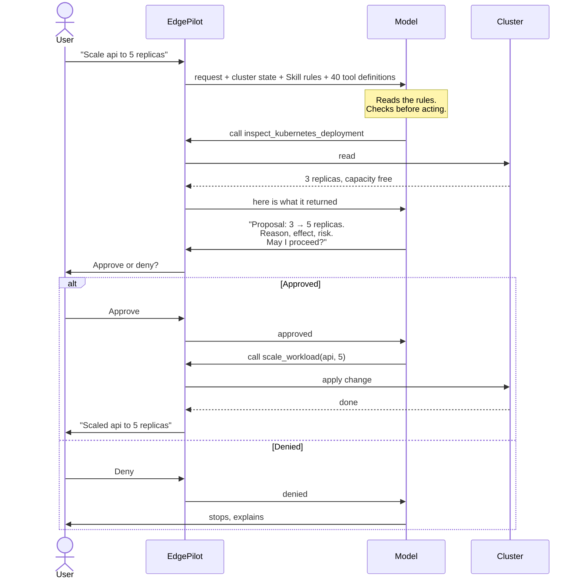

# EdgePilot — The AI Workflow

How one request actually travels through the system.

## The flow

## What each step costs

Every arrow from EdgePilot to the model is a **separate billed request** that
re-sends the whole context. A task that takes 4 round-trips costs roughly four
times a task that takes 1.

That is the single biggest driver of cost, and it is why the Skill matters so
much to the numbers — see [LLM experiments](llm-experiments.md).

## The rules the model follows

The Skill (`.claude/skills/managing-kubernetes/`) tells the model to:

1. Inspect before acting — never assume the current state
2. Never guess a name; ask if a target is ambiguous
3. Refuse if the named thing does not exist
4. Explain the change, the reason, the expected effect and the risk
5. Request human approval before any control action

Rules 2 and 3 are safety. Rule 5 is what makes the approval gate work.

## Safety, in three layers

| Layer | What it stops |
|---|---|
| **The Skill** | The model proposing something reckless in the first place |
| **The approval gate** | The 12 high-impact operations configured in the backend running without human approval |
| **Read-only by default** | 25 of 40 tools cannot change anything at all |

The gate is not advisory. For those 12 operations, the backend blocks the call
until a person answers. The registry classifies 15 tools as state-changing in
total. Local app launch, local task termination, and historical-sample
ingestion are currently treated as lower-impact operations and do not use the
approval gate. This distinction should be reconsidered before production use.

## What this workflow can and cannot do today

**Works now:** inspect a cluster, scale, restart, cordon a node, migrate a
workload, read metrics, propose and apply resource changes — all on Kubernetes.

**Built but untested on real data:** everything Slurm/HPC. Waiting on Quest
access.

**Not built:** creating arbitrary pods or directly scheduling individual pods.