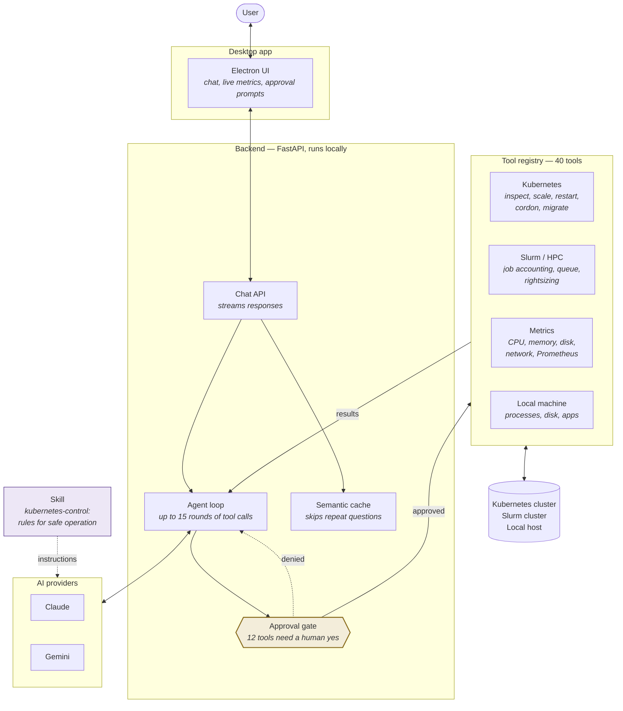

# EdgePilot — Architecture

## What it is

An on-premises AI copilot for cluster operations. You ask a question in plain
English. It reads real system state through tools, then either answers or
proposes an action. Anything that changes state stops and asks you first.

Everything runs locally. Cluster data and job records never leave the machine.

## The system

## The pieces

| Piece | What it does |
|---|---|
| **Electron UI** | Desktop chat window, live telemetry, approval prompts |
| **FastAPI backend** | Runs locally. Manages chats, calls the model, executes tools |
| **Agent loop** | Model calls a tool → backend runs it → result goes back to the model → repeat until done |
| **Approval gate** | 12 of the 40 tools change state. Each one stops and waits for a human |
| **Skill** | A written set of rules the model follows: verify capacity, explain the change, never guess a name |
| **Tool registry** | 40 tools. 25 read-only, 15 change something |
| **Semantic cache** | Recognises a repeat question and answers without calling the model |
| **Providers** | Claude and Gemini are swappable. GPT is a placeholder |

## Where the data comes from

- **Kubernetes** — live cluster, via the Kubernetes API
- **Prometheus / Grafana** — hardware metrics
- **Slurm** — job accounting and queue state. Built, but **not yet connected to
  real data**; waiting on Northwestern Quest access. Tested against mock data
- **Local host** — CPU, memory, disk, processes
